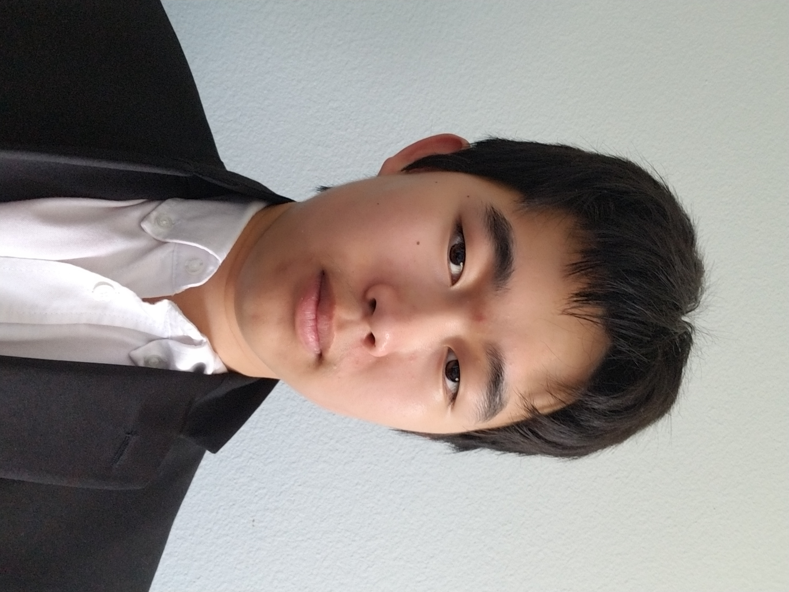

## About Me

I am an undergraduate student at the University of California, Berkeley, double majoring in Applied Math and Computer Science. I am especially interested in machine learning and artificial intelligence. I will be graduating from UC Berkeley in 2024.

## My Experience

#### NewsBreak

I interned at NewsBreak, a company that focuses on providing news tailored to a user’s 
location and interests through their mobile app, NewsBreak, under my mentor, Zhengwen Wang. I worked as a front-end programmer for the NewsBreak iOS app, where I used XCode to design a part of the app and became proficient in Swift, data fetching, and programmatic coding in UIKit. The part I designed will be released as the discover-search page of the app.

#### UCSD Nanomaterials and Nanomedicine Laboratory

I interned at UCSD as a Research Analyst Intern. I implemented modern cell membrane coating technology, including cell counting, pating, culturing, and membrane derivation procedures. I made use of lab equipment such as autoclaves and pipettes. Our results were published in an academic journal: "<a href="https://doi.org/10.1002/btm2.10187">Cartilage-targeting ultrasmall lipid-polymer hybrid nanoparticles for the prevention of cartilage degradation</a>," <i>Bioengineering & Translational Medicine, 2021; 6; e10187.</i>

## My Education

#### University of California, Berkeley (2020-2024)

I am an undergraduate at the University of California, Berkeley. I am majoring in Computer Science and Applied Math.

#### Westview High School

I attended Westview High School, where I graduated with a GPA of 3.9 out of 4.0.

## Skills

<ul class=skilllist>
      <li>C</li>
      <li>C++</li>
      <li>Java</li>
      <li>CSS</li>
      <li>HTML5</li>
      <li>Javascript</li>
      <li>Python</li>
      <li>RISC-V</li>
      <li>SQL</li>
      <li>LaTeX</li>
      <li>Swift</li>
      <li>PyTorch</li>
    </ul>

## My Projects

#### [Pintos Filesys Operating System](https://github.com/DerrickhSun/CS162OSFilesys)
      
I wrote an operating system in Pintos using C. The system has the basics, such as process execuation, syscalls, and floating point operations. It also has a working filesystem, including a buffer cache, extensible files, subdirectories and file locking. However, it only has basic multithreading, and is lacking many features such as an internal clock and priority lending.

#### [Pintos Multithreaded Operating System](https://github.com/DerrickhSun/CS162OSMultithreading)

I wrote an operating system in Pintos using C. The system has the basics, such as process execuation, syscalls, and floating point operations. It is multithreaded, implementing locks, thread priorities, priority lending, and an internal clock. However, it is lacking many filesystem features such as subdirectories and a buffer cache.

#### [Matrix Multiplication](https://github.com/61c-student/sp21-proj4-DerrickhSun)

I implemented matrix multiplication in a mix of C and Python, then optimized it with unrolling, cache blocking, parallelizing, call reducing, and other optimizations. The finished result created matrix objects from certain input and performed matrix multiplication on the matrices.

#### [Project Ark](https://github.com/DerrickhSun/ProjectArk)

A video game made using characters from the game "Arknights" and gameplay inspired by "Smash Bros." I started this game as a tool to practice my Java skills.

The game has three useable characters and is best played with two players. It is admittedly not user-friendly, as it was only intended as a for-fun project and I frequently have to stop part way through updates due to school. The game is run from the driver file in src.
